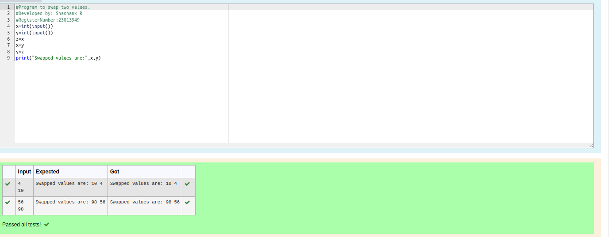

# Swapping-two-values
## AIM:
Shashank
To write a python program for swapping of two values
## EQUIPEMENT'S REQUIRED: 
PC
Anaconda - Python 3.7
## ALGORITHM: 
### Step 1:
Get the two values from the user
### Step 2: 
Assign the value of second variable to a temporary variable 
### Step 3: 
Assign the value of the first variable to the second variable.
### Step 4:  
Assign the value in temporary variable to the first variable
### Step 5: 
Print both the values it would be interchanged
### Step 6: 
End the program

## PROGRAM:

~~~python
#program to swap two values
#devoloped by :Shashank R
#Refrence Number:23013949

x=int(input("Enter the x value"))
y=int(input("enter the y value"))
temp=x
x=y
y=temp
print(f"value of x is{x}and value of y is{y}")

~~~
## OUTPUT:

## RESULT:
Thus the swapping of two values are successfully executed

